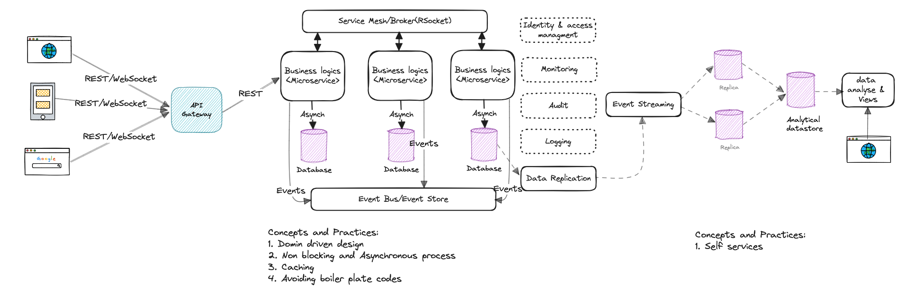

## Backend protocols:
1. Protocols: RSocket, GraphQL, REST
2. Service Intercommunications: Service Mesh, RSocket Broker
3. Patters:
	1. Event Sourcing
	2. CQRS
	3. SAGA
4. @todo
5. 

## Messaging 
1. Event Bus: Apache Pulsar

## Frontend stacks:
1. REactJS
2. Protocols: REST, WebSockets
2. Identification/SSO etc. KeyCloack

## Datamesh
1. Patterns:
	1. Transactional Outbox
	2. Event Sourcing
	3. Transactional Log CDC
2. Strategies:
	1. Self service
3. Tools:
	1. Apache Nifi
	2. Custom
	
	
