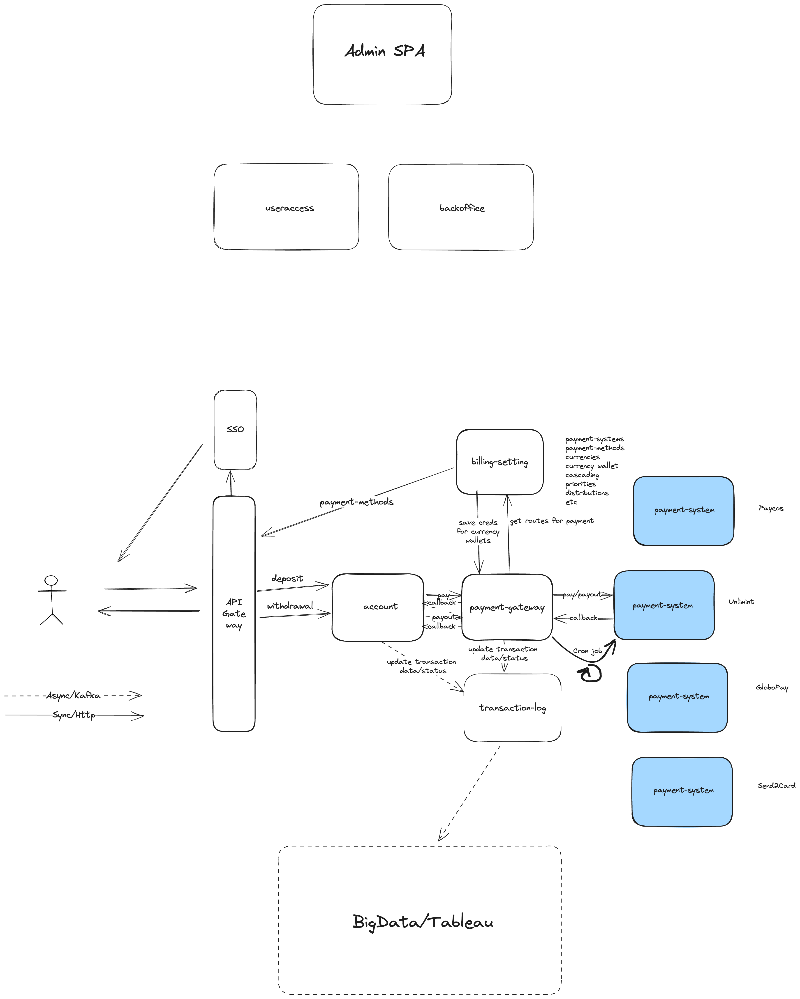

## System descriptions:

### Payment System
3rd party payment system likes PayPal, Globalpay 

### Payment gateway
A router between payment systems

### Payment settings

### Transaction log

### Account 

### API Gateway 

## Backend protocols:
1. Protocols: RSocket, GraphQL, REST
2. Service Intercommunications: Service Mesh, RSocket Broker
3. Patters:
	1. Event Sourcing
	2. CQRS
	3. SAGA
4. Frameworks:
	1. Quarkus
	2. Spring boot
5. @todo

## Messaging 
1. Event Bus: Apache Pulsar

## Frontend stacks:
1. ReactJS
2. Protocols: REST, Asynch (kafka)
2. Identification/SSO etc. KeyCloack
3. API Gateway. 

## Datalake
1. Hadoop
2. Cassandra 

	
	
